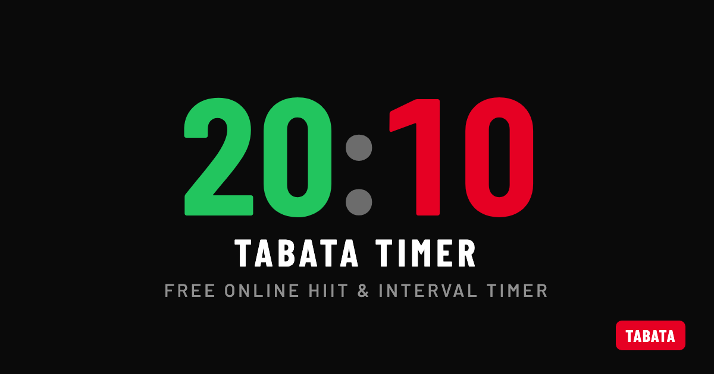

<div align="center">

# ⏱️ Tabata Timer

**A free, minimalist fullscreen interval timer for the gym — on the web and desktop.**

Big countdown numbers, green **WORK** / red **REST**, audio cues, themes, and confetti when you finish.



[](https://github.com/vekaev/tabata/actions/workflows/ci.yml)
[](https://vite.dev)
[](https://react.dev)
[](https://www.typescriptlang.org)
[](https://tailwindcss.com)
[](https://playwright.dev)
[](LICENSE)

<br />

### ⬇️ Download

[](https://github.com/vekaev/tabata/releases/latest/download/Tabata-mac.dmg)
[](https://github.com/vekaev/tabata/releases/latest/download/Tabata-Setup.exe)
[](https://github.com/vekaev/tabata/releases/latest/download/Tabata-linux.AppImage)

**[▶ Try it in the browser](https://tabata.example)** — no install needed.

<sub>The buttons download directly. macOS is a **universal** build (Apple Silicon + Intel); on first launch, right-click the app → **Open** (it isn't signed with a paid Apple certificate). [All releases →](https://github.com/vekaev/tabata/releases/latest)</sub>

</div>

---

## ✨ Features

- **Three modes** — **Tabata** (configurable HIIT intervals), **Clock** (a huge live fullscreen clock), and **Timer** (a simple countdown).
- **Fully configurable Tabata** — rounds, work, rest, **sets** (groups of rounds with a rest between them), and a "get ready" prepare countdown.
- **Recent + presets** — built-in presets plus a **Recent** history of everything you've run (latest first); save any recent config as a named preset. The active config is highlighted.
- **Drift-free engine** — the countdown derives remaining time from an absolute `performance.now()` deadline every tick, so it never accumulates drift and keeps running accurately even when the tab is in the background.
- **Skip / pause / resume / restart** — full control mid-workout, with audio cues (synthesized via Web Audio — no asset files): 3-2-1 pips and distinct work / rest / finish tones.
- **Themes** — light / dark / **auto** (follows the OS), an accent color (red, presets, or any **custom color**), and **4 display fonts**. Applied before first paint, persisted locally.
- **6 languages** — English, Español, Français, Deutsch, Português, Українська — auto-detected from the browser and switchable.
- **Designed for any screen** — one fluid layout from 320px phones to gym TVs (`dvh`, safe-area insets, `vmin`-scaled digits, 44–48px touch targets, press-and-hold number steppers).
- **Accessible** — large WORK/REST text labels (never color alone), ARIA labels, full keyboard control, reduced-motion support, screen-awake via the Wake Lock API.
- **Confetti** on completion 🎉 — and **keyboard shortcuts** everywhere (`Space`, `→`/`S`, `←`, `R`).
- **Discoverable & shareable** — per-route titles, Open Graph / Twitter cards, JSON-LD, `sitemap.xml`, `robots.txt`, `/llms.txt`, and a PWA manifest.

## ⌨️ Keyboard shortcuts

| Key | Action |
|-----|--------|
| `Space` | Start / pause / resume |
| `→` or `S` | Skip to next phase (Tabata) |
| `←` | Back |
| `R` | Restart / reset |
| `↑` / `↓` | Adjust the focused number field |

## 🚀 Quick start

```bash
npm install
npm run dev          # web app → http://localhost:5173
npm run dev:electron # run inside an Electron desktop window
```

## 📦 Build

```bash
npm run build            # web build → dist/   (deploy this)
npm run build:electron   # desktop installer → release/
npm run gen:assets       # regenerate icons + the Open Graph image
npm run lint             # eslint
```

> [!IMPORTANT]
> **Before deploying:** set your real domain in `.env` (`VITE_SITE_URL`) — it's injected into the canonical / Open Graph / structured-data tags — and replace `tabata.example` in `public/robots.txt`, `public/sitemap.xml` and `public/llms.txt`.

## 🧪 Test

```bash
npm run test:e2e         # Playwright (desktop Chromium + mobile)
npm run test:e2e:ui      # interactive UI mode
```

Timer tests drive a virtual clock (`page.clock`) so a 4-minute workout verifies in milliseconds, with zero flakiness.

## 🚢 Deploy

**Web → Cloudflare Pages** (or any static host): build command `npm run build`, output directory `dist`. No SPA config needed — Cloudflare Pages auto-serves `index.html` for client-side routes (don't add a `404.html` or a `/* /index.html` redirect, which Pages flags as a loop). Set `VITE_SITE_URL` to your domain so the canonical/OG tags are correct.

**Desktop → GitHub Releases**: push a `vX.Y.Z` tag and [`.github/workflows/release.yml`](.github/workflows/release.yml) builds installers on macOS/Windows/Linux and publishes them with auto-update metadata. The app then auto-updates via `electron-updater` (Windows/Linux work unsigned; macOS needs Developer ID signing + notarization).

## 🛠️ Tech stack

**Vite + React + TypeScript + TanStack Router** (file-based routes), styled with **Tailwind CSS v4** (CSS-first theming via `@theme inline` + CSS variables). **Electron** is an optional desktop wrapper that never touches the web build. End-to-end tested with **Playwright**.

A single env flag (`ELECTRON=1`) switches the two targets:

| | Web (`npm run build`) | Desktop (`npm run build:electron`) |
|---|---|---|
| `base` | `/` (absolute asset paths) | `./` (relative, for `file://`) |
| Router history | browser history | hash history |
| Electron main/preload | not built | built to `dist-electron/` |

The renderer never imports `electron` or any `node:*` module — the only desktop integration is a `contextBridge` flag in `electron/preload.ts`.

## 📁 Project structure

```
src/
  routes/                # TanStack file-based routes (each sets its own <title>)
    index.tsx            #   /         mode menu (Tabata / Clock / Timer)
    tabata.tsx           #   /tabata   config: fields, presets, Recent history
    workout.tsx          #   /workout  the running Tabata timer + done + confetti
    clock.tsx            #   /clock    huge live wall clock
    timer.tsx            #   /timer    simple countdown timer
  lib/
    tabata.ts            # config model + sequence builder (pure)
    useTabataTimer.ts    # drift-free timer engine hook
    useTheme.ts          # theme (mode / accent / font)
    i18n.ts              # tiny i18n store + 6 language dictionaries
    audio.ts             # Web Audio cue engine
    storage.ts           # localStorage (config, presets, history, settings)
    platform.ts          # wake lock, fullscreen, Electron detection
  components/            # corner controls, theme panel, number stepper, modal, icons
  index.css             # Tailwind v4 + theme tokens (@theme inline)
electron/               # main + preload (desktop only)
e2e/                    # Playwright tests
public/                 # robots.txt, sitemap.xml, llms.txt, manifest, icons, og-image
```

## 🗺️ Roadmap

- More modes: EMOM, AMRAP, For Time
- Workout chaining (warm-up → Tabata → cooldown)
- Spoken round call-outs (TTS) and custom sounds
- Workout history & shareable preset links

## 📄 License

[MIT](LICENSE) — free to use, modify, and share.

<div align="center">
<sub>Built with care for people who count seconds. 💪</sub>
</div>
